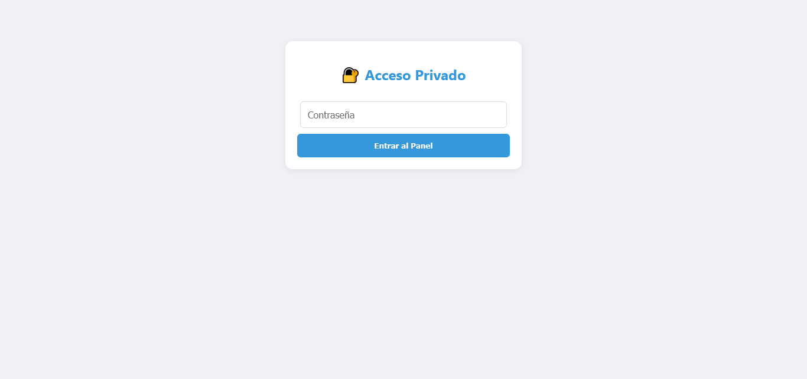
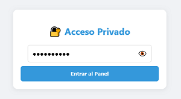
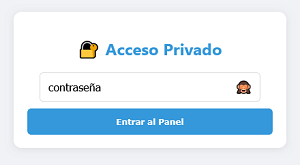
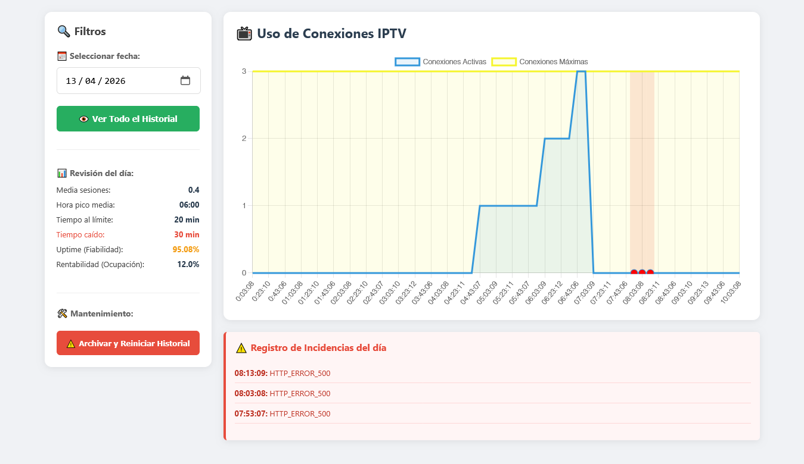

# 📺 IPTV Monitor Dashboard

Un panel de monitorización ligero, seguro y visual para conexiones IPTV (basadas en la API de Xtream Codes). Desarrollado en PHP y JavaScript (Chart.js), este proyecto permite registrar, archivar y analizar el uso de tus conexiones a lo largo del tiempo sin necesidad de bases de datos pesadas.






## ✨ Características Principales

* **📊 Dashboard Interactivo:** Visualización gráfica del uso de conexiones y límites contratados mediante Chart.js.
* **🛡️ Seguridad Integrada:** Acceso protegido por contraseña mediante sesiones PHP nativas.
* **🕵️ Bypass Anti-Bloqueo:** Simulación de *User-Agent* (`IPTVSmartersPro`) para evitar bloqueos 403 por parte de los proveedores.
* **⏱️ Bucle de Alta Resolución:** Optimizado para hostings compartidos (como OVH) que limitan las tareas Cron a 1 hora. El script mantiene la ejecución internamente para capturar datos cada 10 minutos.
* **📈 KPIs Avanzados:** Cálculo en tiempo real de métricas clave:
  * Disponibilidad del servicio (Uptime %).
  * Tasa de ocupación / Rentabilidad de la suscripción.
  * Promedio de conexiones activas.
  * Identificación de la "Hora Pico" de uso.
* **🚨 Registro de Incidencias:** Identificación visual (franjas rojas en la gráfica) y listado detallado de caídas del servidor (Errores 500, Timeouts, etc.).
* **🗄️ Gestión de Datos Liviana:** Almacenamiento basado en archivos `.csv` con opción de archivado histórico (sin necesidad de MySQL).

## 🛠️ Requisitos del Sistema

* Un servidor web (Apache, Nginx, etc.)
* PHP 7.4 o superior (con extensión `cURL` habilitada).
* Permisos para configurar Tareas Programadas (**Cron Jobs**) en el servidor.
* Permisos de escritura en el directorio del proyecto (para generar los archivos `.csv`).

## 🚀 Instalación y Configuración

**1. Clonar o descargar el repositorio**
Descarga los 3 archivos principales (`index.html`, `api.php`, `monitor_iptv.php`) en una carpeta de tu servidor web (ej. `tuservidor.com/monitor/`).

**2. Configurar credenciales de IPTV (`monitor_iptv.php`)**
Abre el archivo y edita las siguientes variables con los datos de tu proveedor:
```
$url_base = "[http://tu-proveedor.com:8080](http://tu-proveedor.com:8080)"; 
$usuario = "tu_usuario_aqui";
$password = "tu_contraseña_aqui";
```
**3. Configurar contraseña de acceso (`api.php`)**
Abre el archivo y cambia la contraseña por defecto para acceder al panel web:
```
$password_correcta = "CambiaEstaContraseña123!";
```
**4. Configurar la Tarea Cron**
Para que el sistema recoja datos automáticamente, debes configurar tu servidor para que ejecute el archivo `monitor_iptv.php`1 vez cada hora (en el minuto 0).

Ejemplo de comando Cron en cPanel / Linux:
```
0 * * * * /usr/bin/php /ruta/absoluta/a/tu/carpeta/monitor_iptv.php >/dev/null 2>&1
```
_(Nota: El script está diseñado internamente para ejecutarse en bucle 6 veces durante esa hora para capturar datos cada 10 minutos)._

## ⚠️ Advertencia de Seguridad Importante

NUNCA subas este código a un repositorio público con tus credenciales reales de IPTV ni tu URL.
Asegúrate de dejar las variables vacías o con datos ficticios antes de hacer un commit. Si crees que has expuesto tus credenciales en algún momento, solicita a tu proveedor un cambio de contraseña inmediatamente.

## 📄 Licencia

Este proyecto se distribuye bajo la licencia MIT. Eres libre de usarlo, modificarlo y distribuirlo, tanto para uso personal como comercial. Consulta el archivo LICENSE para más detalles.

Desarrollado con ❤️ para la comunidad.